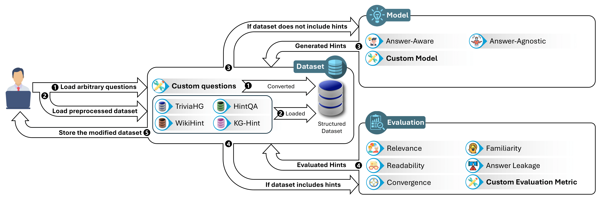

<p align="center">
  
</p>

<p align="center">
  <a href="http://hinteval.readthedocs.io/"></a>
  <a href=""></a>
  <a href="https://opensource.org/license/apache-2-0"></a>
  <a href="https://pepy.tech/projects/hinteval"></a>
  <a href="https://github.com/DataScienceUIBK/HintEval/releases"></a>
</p>

**HintEval** is a powerful framework designed for both generating and evaluating hints. These hints serve as subtle clues, guiding users toward the correct answer without directly revealing it. As the first tool of its kind, HintEval allows users to create and assess hints from various perspectives. 

<p align="center">

</p>

## ✨ Features
 - **Unified Framework**: HintEval combines datasets, models, and evaluation metrics into a single Python-based library. This integration allows researchers to seamlessly conduct hint generation and evaluation tasks.
 - **Comprehensive Metrics**: Implements five core metrics—Relevance, Readability, Convergence, Familiarity, and Answer Leakage—with lightweight to resource-intensive methods to cater to diverse research needs.
 - **Dataset Support**: Provides access to multiple preprocessed and evaluated datasets, including TriviaHG, WikiHint, HintQA, and KG-Hint, supporting both answer-aware and answer-agnostic hint generation approaches.
 - **Customizability**: Allows users to define their own datasets, models, and evaluation methods with minimal effort using a structured design based on Python classes.
 - **Extensive Documentation**: Accompanied by detailed online documentation and tutorials for easy adoption.

## 🔎 Roadmap
 - **Enhanced Datasets**: Expand the repository with additional datasets to support diverse hint-related tasks.
 - **Advanced Evaluation Metrics**: Introduce new evaluation techniques such as Unieval and cross-lingual compatibility.
 - **Broader Compatibility**: Ensure support for emerging language models and APIs.
 - **Community Involvement**: Encourage contributions of new datasets, metrics, and use cases from the research community.
## 🖥️ Installation

It's recommended to install HintEval in a [virtual environment](https://docs.python.org/3/library/venv.html) using [Python 3.11.9](https://www.python.org/downloads/release/python-3119/). If you're not familiar with Python virtual environments, check out this [user guide](https://packaging.python.org/guides/installing-using-pip-and-virtual-environments/). Alternatively, you can create a new environment using [Conda](https://anaconda.org/anaconda/conda).

### Set up the virtual environment

First, create and activate a virtual environment with Python 3.11.9:

```bash
conda create -n hinteval_env python=3.11.9 --no-default-packages
conda activate hinteval_env
```

### Install PyTorch 2.4.0

You'll need PyTorch 2.4.0 for HintEval. Refer to the [PyTorch installation page](https://pytorch.org/get-started/previous-versions/) for platform-specific installation commands. If you have access to GPUs, it's recommended to install the CUDA version of PyTorch, as many of the evaluation metrics are optimized for GPU use.

### Install HintEval

Once PyTorch 2.4.0 is installed, you can install HintEval via pip:

```bash
pip install hinteval
```

For the latest features, you can install the most recent version from the main branch:

```bash
pip install git+https://github.com/DataScienceUIBK/HintEval
```

## 🏃 Quickstart

Refer to our [documentation](http://hinteval.readthedocs.io/) to learn more.

## ⚙️ Components
HintEval is modular and customizable, with core components designed to handle every stage of the hint generation and evaluation pipeline:

### 1. Dataset Management
 - **Preprocessed Datasets**: Includes widely used datasets like TriviaHG, WikiHint, and HintQA.
 - **Dynamic Dataset Loading**: Use Dataset.available_datasets() to list, download, and load datasets effortlessly.
 - **Custom Dataset Creation**: Define datasets using the Dataset and Instance classes for tailored hint generation.
### 2. Hint Generation Models
 - **Answer-Aware Models**: Generate hints tailored to specific answers using LLMs like Meta LLaMA-3.1.
 - **Answer-Agnostic Models**: Generate hints without requiring specific answers for open-ended tasks.
### 3. Evaluation Metrics
 - **Relevance**: Measures how well hints relate to the question.
 - **Readability**: Assesses grammatical and syntactical quality.
 - **Convergence**: Evaluates how effectively hints lead users to correct answers.
 - **Familiarity**: Rates hints based on the commonness of knowledge.
 - **Answer Leakage**: Detects if hints reveal answers too directly.
### 4. Model Integration
 - Integrates seamlessly with API-based platforms (e.g., TogetherAI).
 - Supports custom models and local inference setups​

## 🤖 Supporting Methods
HintEval includes built-in support for state-of-the-art methods and encourages user extensions:

### Supported Methods
1. **Answer-Aware Hint Generation**: Uses LLMs optimized for hint generation tasks, such as Meta LLaMA or GPT-series models.
2. **Answer-Agnostic Hint Generation**: Generates hints without predefined answers, allowing for greater flexibility in ambiguous scenarios.
3. **Evaluation Techniques**:
 - Rouge-L for relevance scoring.
 - Machine Learning-Based Models for readability assessments.
 - Contextual Embeddings to measure answer leakage.
### Community Contributions
HintEval allows researchers to add their own models, datasets, and metrics by extending base classes. It provides templates for building new components easily.

## 📓 Supporting Datasets & Document Corpus
HintEval supports a range of preprocessed datasets for hint generation and evaluation, alongside user-defined corpora:

### Preprocessed Datasets
 - **TriviaHG**: Trivia-based question-answer-hint triples.
 - **WikiHint**: Wiki-derived hint datasets focused on general knowledge.
 - **HintQA**: Designed for evaluating question-answer-hint pipelines.
 - **KG-Hint**: Focused on knowledge graph-based hint creation.
### Custom Dataset Support
 - Use the Dataset class to create, load, or export datasets.
 - Supports integration with popular libraries like 🤗datasets for additional flexibility.

## 🤝Contributors

Community contributions are essential to our project, and we value every effort to improve it. From bug fixes to feature enhancements and documentation updates, your involvement makes a big difference, and we’re thrilled to have you join us! For more details, please refer to [development.](DEVELOPMENT.md)

### How to Add Your Own Dataset

If you have a dataset on hints that you'd like to share with the community, we'd love to help make it available within HintEval! Adding new, high-quality datasets enriches the framework and supports other users' research and study efforts.

To contribute your dataset, please reach out to us. We’ll review its quality and suitability for the framework, and if it meets the criteria, we’ll include it in our preprocessed datasets, making it readily accessible to all users.

To view the available preprocessed datasets, use the following code:

```python
from hinteval import Dataset

available_datasets = Dataset.available_datasets(show_info=True, update=True)
```

Thank you for considering this valuable contribution! Expanding HintEval's resources with your work benefits the entire community.

### How to Contribute

Follow these steps to get involved:

1. **Fork this repository** to your GitHub account.

2. **Create a new branch** for your feature or fix:

   ```bash
   git checkout -b feature/YourFeatureName
   ```

3. **Make your changes** and **commit them**:

   ```bash
   git commit -m "Add YourFeatureName"
   ```

4. **Push the changes** to your branch:

   ```bash
   git push origin feature/YourFeatureName
   ```

5. **Submit a Pull Request** to propose your changes.

Thank you for helping make this project better!


## 🪪License
This project is licensed under the Apache-2.0 License - see the [LICENSE](https://opensource.org/license/apache-2-0) file for details.

## ✨Citation
If you find this work useful, please cite [📜our paper]():
### Plain

To be announced.

### Bibtex
```bibtex
To be announced.
```

## 🙏Acknowledgments
Thanks to our contributors and the University of Innsbruck for supporting this project.
